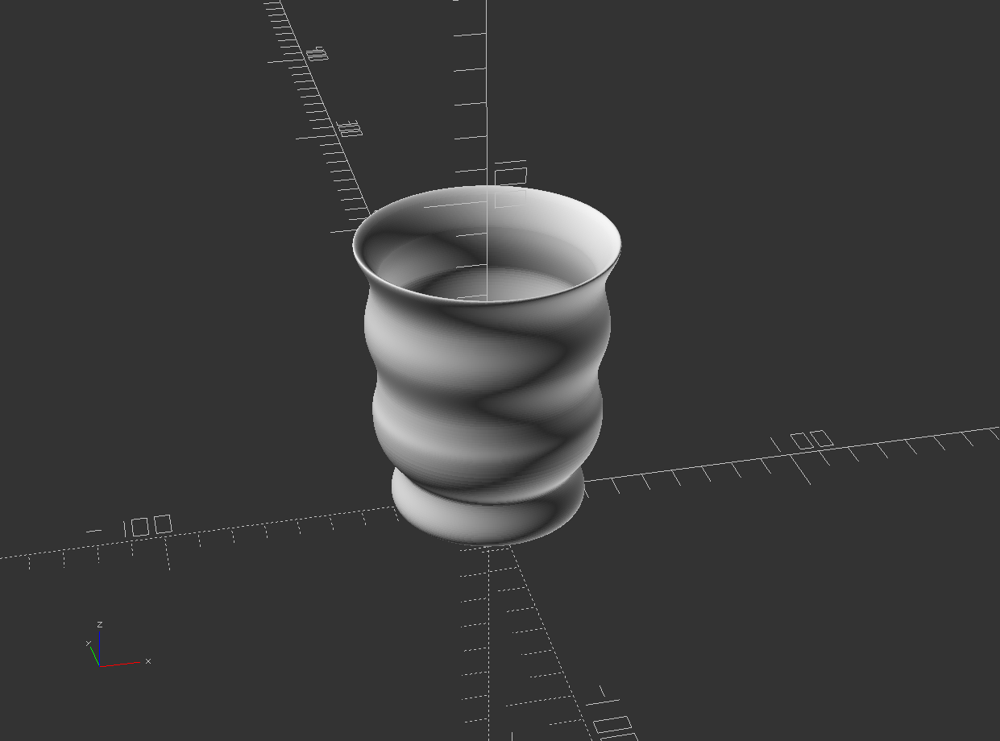

# The wave glass

A simple wavy-looking glass.

You need to print it on some filaments that are food-safe. Not sure what makes
something food-safe however I'm using
[Nonoilen](https://fillamentum.com/collections/nonoilen-filament/) filament for
this one, as it it touts to be food-safe and resists to temperatures above
100°C, which is enough for a cup of tea.

This is made using [OpenSCAD](https://openscad.org/), you'll need it to generate
the STL file.
